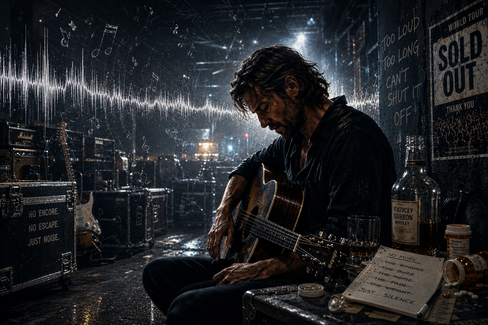

# A Star is Born

*A Star is Born* (2018) is a film following the journey of two musicians, Jackson and Ally. Jackson is a successful musician suffering from depression, substance abuse, and tinnitus, while Ally is a struggling hoping to make it big. American actor and director Bradley Cooper directed the movie and played the role of Jackson, and American singer-songwriter and actress Lady Gaga performed as Ally. Jackson’s pain and suffering is portrayed throughout the whole movie, along with the difficulties that those around him go through. The music in the movie depicts illness by sharing emotions and thoughts of Jackson and Ally.

Namely, Jackson sings about change and how it seems the time to get rid of old ways has come in the song [“Maybe It’s Time”](https://youtu.be/RdljoTFMhO4?si=x00c_mhwRfp0o-WB). Written by Jason Isbell and performed by Bradley Cooper, the song seems to convey hope for a different future, away from the addiction that created suffering in the past. While [“Black Eyes”](https://youtu.be/DqlUt0Ff70Q?si=vccuRcAEN2fJdXhZ) (written by Bradley Cooper, Lukas Nelson, and Alberto Bof), the song Jackson plays at his concert in the opening of the movie, is filled with intense sounds from the drum, bass, and electric guitar, “Maybe It’s Time” only has an acoustic guitar in the background. [“Alibi”](https://youtu.be/0dR5yIHZs-w?si=q3UfMHrLxjuyluMt) (written by Lady Gaga, Bradley Cooper, and Lukas Nelson), another song we hear from Jackson on stage, also has musical qualities similar to that of “Black Eyes”. While the lyrics of these songs also convey Jackson’s struggle when looked at closely, they are easily lost in the fast tempo, loud instruments, and rough vocals. “Maybe It’s Time”, with its emotional melody, confesses the internal struggle Jackson tries to hide onstage with loud sounds.

The movie also portrays how unstable Jackson is through the distortion of music and sound. During the scenes in the latter part of the movie where Jackson’s addiction and depression gets worse, sometimes the audience can only hear certain instruments and certain sounds are intentionally prolonged. These scenes convey Jackson’s painful and unstable state through music. Another part of the movie that is worth noting is Jackson’s tinnitus. The audience can hear and experience Jackson’s tinnitus throughout the whole movie. At the very start of the movie, Jackson leaves the loud concert and gets into a quiet car. A few moments later, a high-pitched sound continues for a while. This sound can be heard in multiple scenes as well as the movie goes on. The fact that these sounds are heard as other sounds are faded out shows how Jackson’s isolation from the world and the relationships around him can be worsen by his sensory disability.

[*Inside Llewyn Davis*](./choi-dahyeon.md) can be referred to as another movie portraying the depression of a singer-songwriter through music. Llewyn Davis, the protagonist, suffers after his partner in duet commits suicide. Just like in *A Star is Born*, his emotions and suffering are portrayed through his music as a musician.

# 스타 이즈 본

〈스타 이즈 본〉(A Star is Born, 2018)은 잭슨(Jackson)과 앨리(Ally), 두 음악가의 이야기를 담은 영화이다. 잭슨은 성공한 가수로서의 커리어를 갖고 있지만, 우울증, 약물 및 알코올 중독, 그리고 이명에 고통받고, 앨리는 뛰어난 음악적 재능을 가졌지만 아직 유명해지지 못해 힘든 나날을 보내고 있다. 미국의 배우 겸 감독 브래들리 쿠퍼(Bradley Cooper)가 감독하고 잭슨 역을 연기했으며, 싱어송라이터 겸 배우 레이디 가가(Lady Gaga)가 앨리 역을 맡았다. 영화의 줄거리 전반에 잭슨의 고통이 나타나며, 이를 지켜보며 돕고자하는 앨리를 비롯한 주변 인물의 어려움도 나타난다. 영화는 잭슨과 앨리의 심정을 담은 곡을 여러 곡 포함하며 질병과 그 영향을 묘사하고 있다.

영화 초반 잭슨이 부르는 [〈Maybe It’s Time〉](https://youtu.be/RdljoTFMhO4?si=x00c_mhwRfp0o-WB)이라는 곡은 과거의 방식을 버리고 변화할 때가 왔다고 말하고 있다. 이 곡은 제이슨 이스벨(Jason Isbell)이 작곡하고 브래들리 쿠퍼가 가창을 맡았다. 가사는 다양한 의미로 해석될 수 있겠지만, 술과 약물에 중독되어 지내던 지난 날들과는 변화한 모습의 앞날을 희망한다는 것으로 이해할 수 있다. 영화가 시작하자마자 잭슨이 콘서트에서 연주하는 [〈Black Eyes〉](https://youtu.be/DqlUt0Ff70Q?si=vccuRcAEN2fJdXhZ)(브래들리 쿠퍼, 루카스 넬슨(Lukas Nelson), 알베르토 보프(Alberto Bof) 작곡)는 강렬한 드럼과 베이스, 일렉트릭 기타의 사운드가 지배적인 반면, 〈Maybe It’s Time〉은 잭슨의 어쿠스틱 기타만을 반주로 한다. 영화의 중간에 등장하는 잭슨의 무대 위 곡 [〈Alibi〉](https://youtu.be/0dR5yIHZs-w?si=q3UfMHrLxjuyluMt)(레이디 가가, 브래들리 쿠퍼, 루카스 넬슨 작곡)도 〈Black Eyes〉와 유사한 음악적 특징을 보인다. 이 곡들도 가사를 자세히 살펴보면 잭슨의 고통이 드러나지만, 이는 빠른 템포와 강렬한 악기 소리, 거친 목소리에 쉽게 묻혀버려 잘 들리지 않는다. 〈Maybe It’s Time〉의 진솔하고 서정적인 선율은 무대 위에서 강렬한 사운드로 감추려 했던 잭슨의 내적 갈등을 고백하고 있다.

영화는 음악과 소리의 왜곡으로 잭슨의 불안정함을 표현하기도 한다. 잭슨의 우울과 중독이 심해지는 영화의 후반부에서는 공연 중 특정 악기의 소리만 크게 들리거나 소리가 늘어지게 들리기도 한다. 이러한 표현은 고통받고 불안정한 잭슨의 상태를 음악을 통해 관객에게 전달하고 있다. 또 주목할 만한 부분은 잭슨의 이명이다. 영화의 초반부터 관객은 잭슨의 이명을 함께 경험하며 이해할 수 있다. 영화 초반 잭슨의 콘서트가 끝난 후, 잭슨은 소란스러운 콘서트장에서 나와 고요한 차 안으로 이동한다. 얼마 후 그 고요함 속에서 높은 음역대의 “삐” 소리가 한동안 지속된다. 이후 다른 장면에서도 이러한 소리는 종종 등장하며, 이 때는 주위의 다른 소리가 잦아든다. 이는 감각적인 장애로 인해 잭슨이 다른 사람들과의 관계와 세상으로부터 느끼는 고립이 심화될 수 있음을 보여준다.

가수의 우울증, 고통을 음악을 통해 표현한 다른 작품으로는 [〈인사이드 르윈 데이비스〉](./choi-dahyeon.md)를 참고할 수 있다. 주인공 르윈 데이비스는 듀엣으로 활동하던 가수로, 파트너의 자살 등 여러 힘든 일을 겪으며 우울증에 시달린다. 영화 속 주인공이 우울증을 겪으며 이를 음악으로 표현하는 가수라는 점에서 두 작품은 공통점이 있다.
