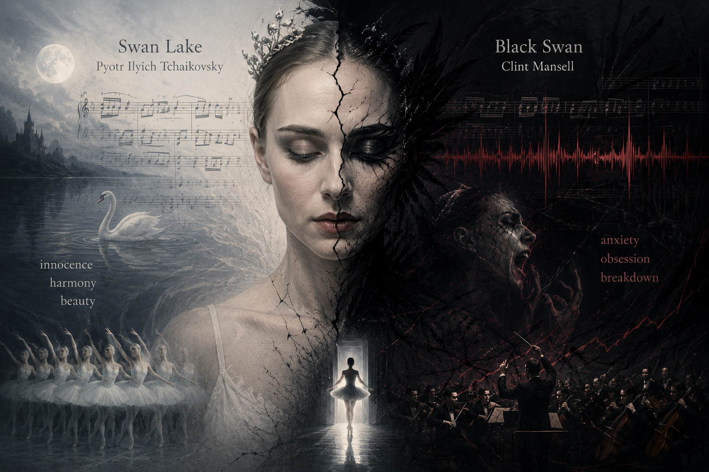

# Black Swan

The main music used in the film *Black Swan* (2010) is Swan Lake, a ballet composed by Pyotr Ilyich Tchaikovsky. Tchaikovsky, born in 1840 and died in 1893, was a Russian composer and one of the most representative figures of the Romantic era. Swan Lake is one of his most famous works and is still considered one of the most widely performed ballet pieces in the world today.

This work is composed as instrumental music, meaning it does not contain any lyrics. Instead, it conveys emotions and narrative through musical elements such as melody, harmony, and rhythm. In Black Swan, the original composition is not used in its pure form; rather, [it is reinterpreted and adapted by composer Clint Mansell.](https://www.youtube.com/watch?v=pZbeMg_jAhM) While preserving the lyrical beauty and elegance of the original ballet music, the film incorporates dissonance, repetition, and tension-filled sound design to emphasize the protagonist’s psychological state. In particular, the sharp tones of the strings and the gradually intensifying musical structure effectively express Nina’s anxiety, obsession, and eventual mental breakdown.

In this film, music functions not simply as background sound but as a key device that reveals the symptoms and progression of mental illness. Nina experiences extreme stress and pressure from her obsession with becoming a perfect ballerina, and she gradually begins to show symptoms of anxiety, obsessive tendencies, and hallucinations. The music in the film changes along with the progression of her condition. In the early part of the film, the melodies are relatively stable and elegant, but later repetitive rhythms, dissonance, and exaggerated sound effects become more prominent, aurally expressing Nina’s confused mental state. In particular, the way the same melody gradually becomes distorted suggests the repeated amplification of obsessive thoughts and anxiety symptoms. Furthermore, the sudden crescendos and intense tension in the music allow the audience to indirectly experience the fear and loss of reality often associated with mental illness.

In scenes where Nina can no longer distinguish herself from others and experiences hallucinations, the music also becomes unstable, blurring the boundary between reality and fantasy. At these moments, the soundtrack uses slightly dissonant tones, sudden dynamic changes in volume, repetitive and obsessive string rhythms, and echoing or overlapping sound effects. Familiar melodies from Swan Lake are slowed down or distorted, further emphasizing Nina’s confusion and loss of reality. For example, in the scene where Nina sees her reflection in the mirror moving independently, sharp string sounds and rapidly intensifying music create extreme tension and fear. In another scene, just before the performance, Nina hallucinates black feathers growing from her body, and the speed and volume of the music increase dramatically, maximizing the sense of chaos between reality and fantasy. These musical changes make the audience feel as if they are directly experiencing Nina’s anxiety and hallucinations rather than simply watching them, effectively portraying the collapse of the boundary between reality and illusion.

This suggests that mental illness is not simply caused by personal weakness, but can worsen under excessive competition, perfectionism, and constant stress. Therefore, the music in Black Swan is not merely decorative; it effectively conveys the characteristics of anxiety disorders, obsessive behavior, and hallucinations, while also serving as an important expressive medium that reveals the relationship between mental illness and human psychology.

# 블랙 스완

영화 Black Swan(2010)에 사용된 주요 음악은(Pyotr Ilyich Tchaikovsky)가 작곡한 발레 음악 Swan Lake이다. 차이코프스키는 1840년에 태어나 1893년에 사망한 러시아 작곡가로 낭만주의 시대를 대표하는 인물 중 하나이다. 이 작품은 기악곡으로 구성되어 있기 때문에 가사가 존재하지 않는다. 대신 선율, 화성, 리듬과 같은 음악적 요소를 통해 감정과 이야기를 전달한다. 영화 Black Swan에서는 이 원곡을 그대로 사용하는 것이 아니라 [작곡가 클린트 만셀이 차이코프스키의 음악을 바탕으로 재구성하여 사용하였다.](https://www.youtube.com/watch?v=pZbeMg_jAhM) 원래의 발레 음악이 가진 서정성과 아름다움을 유지하면서도 불협화음과 반복, 긴장감 있는 삳운드를 추가하여 주인공의 심리 상태를 더욱 강조하는 방식으로 변형되었다. 특히 현악기의 날카로운 소리와 점진적으로 고조되는 음악 구조는 주인공 니나의 불안과 집착, 그리고 정신적 붕괴 과정을 효과적으로 표현한다.

이 영화에서 음악은 단순한 배경 요소를 넘어 정신질환의 증상과 진행 과정을 드러내는 핵심 장치로 기능한다. 니나는 완벽한 발레리나가 되어야 한다는 강박 속에서 극심한 스트레스와 압박을 경험하며, 점차 불안장애와 강박증적 성향, 환각 증세를 보이게 된다. 영화 속 음악 역시 이러한 질병의 진행과 함께 변화한다. 초반에는 비교적 안정적이고 우아한 선율이 사용되지만, 이후에는 반복적인 리듬과 불협화음, 과장된 음향 효과가 강조되면서 니나의 혼란스러운 정신 상태를 청각적으로 표현한다. 특히 동일한 멜로디가 점점 왜곡되어 들리는 방식은 강박적 사고와 불안 증상이 반복적으로 증폭되는 모습을 연상시킨다. 또한 음악의 급격한 고조와 긴장감은 정신질환 환자가 경험하는 공포와 현실감 상실을 관객이 간접적으로 체험하게 만든다.

또한 니나가 자신과 타인을 구분하지 못하고 환각을 경험하는 장면에서는 음악 또한 불안정하게 흔들리며 현실과 환상의 경계를 흐리게 만든다. 이때 음악에서는 음정이 미세하게 어긋나는 불협화음, 갑작스럽게 커졌다 작아지는 다이내믹 변화, 반복적으로 집요하게 이어지는 현악기의 리듬, 그리고 음향이 울리거나 겹쳐 들리는 효과가 사용된다. 특히 익숙했던 Swan Lake의 멜로디가 점차 느려지거나 뒤틀린 형태로 변형되어 등장하면서 니나의 혼란과 현실감 상실을 더욱 강조한다. 예를 들어 니나가 거울 속 자신의 모습이 독립적으로 움직이는 환각을 경험하는 장면에서는 날카로운 현악기 소리와 급격히 고조되는 음향이 사용되어 극도의 불안감과 공포를 형성한다. 또한 공연 직전 니나가 몸에서 검은 깃털이 자라나는 환각을 보는 장면에서는 음악의 속도와 음량이 빠르게 증가하며 현실과 환상이 뒤섞이는 긴장감을 극대화한다. 이러한 음악적 변화는 관객이 니나의 불안과 환각을 단순히 보는 것이 아니라 직접 체험하는 듯한 느낌을 주며, 현실과 환상의 경계가 무너지는 심리 상태를 효과적으로 표현한다.

이는 정신질환이 단순히 개인의 나약함이 아니라 과도한 경쟁, 완벽주의, 지속적인 스트레스 환경 속에서 악화될 수 있음을 보여준다. 따라서 Black Swan의 음악은 단순한 장식적 요소가 아니라 불안장애, 강박증, 환각과 같은 정신질환의 특징을 효과적으로 전달하며, 질병과 인간 심리의 관계를 드러내는 중요한 표현 수단이라고 할 수 있다. 
