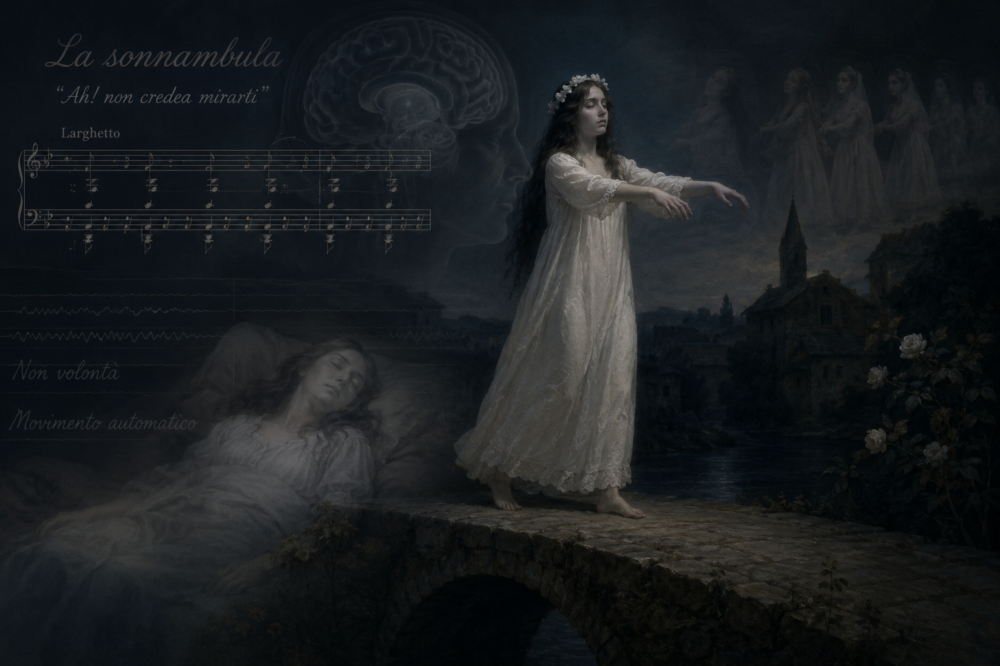

# La Sonnambula

 Amina, a young girl about to be married, suffers from somnambulism (sleepwalking). Sleepwalking is a sleep disorder in which only part of the brain awakens during deep sleep, causing the body to move and perform actions such as walking without conscious awareness. One night, she unknowingly wanders into a stranger's room-the Count's-leading her fiance, Elvino, to misunderstand it as infidelity and call off the wedding. While the entire village condemns her, the final scene depicts Amina crossing a precarious high mill bridge while still asleep, singing this aria. Witnessing this, Elvino and the villagers realize her actions were caused by somnambulism rather than intent, leading to their reconciliation. The song named ‘Ah! non credea mirarti (Ah! I did not believe I would see you)(Vincenzo Bellini, November 3, 1801 - September 23, 1835)’ portrays somnambulism, a sleep disorder, not merely as a psychological wandering but as a physical state of a body devoid of consciousness. In the aria ["Ah! non credea mirarti,"]() the music deliberately restrains flamboyant vocal virtuosity in favor of a very slow, monotonous accompaniment. This rhythm serves to audit the mechanical gait of a physical body moving unconsciously, independent of the character's own will. In particular, the fragile melody seems to vividly reveal Amina’s physical vulnerability as she precariously maintains her balance in a state of sleep. These musical characteristics align with the scene in which Amina, still asleep, crosses the high mill bridge, aurally embodying her unsteady steps and precarious movements as if she might lose her balance at any moment. For further insight, it would be beneficial to consult [sources that discuss related conditions](park-seoungrok.md)

 # 몽유병여인

 결혼을 앞둔 소녀 아미나는 밤중에 자신도 모르게 돌아다니는 몽유병을 앓고 있다. 몽유병은 깊은 수면 상태에서 뇌의 일부만 깨어나, 의식 없이 신체가 움직이며 보행이나 행동을 하는 수면 장애이다. 어느 날 밤, 잠결에 낯선 백작의 방에 들어간 아미나를 보고 약혼자 엘비노는 불륜으로 오해하여 파혼을 선언한다. 마을 사람들 모두가 그녀를 비난 하던 중, 마지막 장면에서 아미나가 잠든 채 위태로운 높은 물레방아 다리를 건너며 이 아리아를 부른다. 이 광경을 목격한 엘비노와 마을 사람들은 그녀가 고의가 아닌 몽유병으로 인해 행동했음을 깨닫고 오해를 풀게 된다. 잠든 상태에서 아미나는 ’아! 믿을 수 없어라 (Ah! non credea mirarti)(빈첸초 벨리니, 1801년 11월 3일 ~ 1835년 9월 23일‘를 부른다. [이 음악](https://youtu.be/pouHB3wImTc?si=HY3WAe8cBbL-YMkV)은 몽유병이라는 수면 장애를 단순한 심리적 방황이 아닌, 의식이 결여된 신체의 물리적 상태로 묘사 한다. 아리아 '아! 믿을 수 없어라'에서는 화려한 기교를 절제하고 아주 느리고 단조로운 반주 리듬을 유지하는데, 이는 본인의 의지가 아닌 무의식 중에 기계적으로 움직이는 육체의 보폭을 청각화한 것이다. 특히 갸냘픈 선율은 수면 상태에서 위태롭게 균형을 잡는 아미나의 물리적 취약성을 그대로 드러내는 듯 하다. 이러한 음악적 특징은 아미나가 잠든 채 높은 물레방아 다리를 건너는 장면과 맞물려, 균형을 잃을 듯 이어지는 보폭과 불안정한 움직임을 청각적으로 구체화한다. 특히 일정하고 느린 반주 리듬은 아미나가 잠든 채 물레방아 다리를 한 걸음씩 건너는 움직임과 맞물려, 관객으로 하여금 언제 균형을 잃을지 모른다는 긴장감을 지속적으로 느끼게 한다. 다만 실제 몽유병은 작품에서의 아미나처럼 극적으로 높은 장소를 안전하게 이동하거나 복잡한 행동을 수행하는 경우는 드물며, 대개 단순 보행이나 반복 행동의 형태로 나타난다. 이와 관련해서는 전향성 기억상실증을 다룬 [다른 소설의 내용](park-seoungrok.md)도 참조할 수 있는데, 두 작품 모두 의식과 기억의 단절로 인해 자신의 의지와 무관하게 일상이 유지된다는 점에서 공통적으로 인간의 통제 불가능성과 취약성을 드러낸다. 또한 '지킬 앤 하이드' 역시 한 인물 내부에서 의식적을 통제되지 않는 또 다른 행동 양상이 나타난다는 점에서 몽유병과 비교해 볼 수 있으며, 이와 관련해서는 [관련 문서](ham-yeji.md)를 함께 참조하면 도움이 될 것이다.

