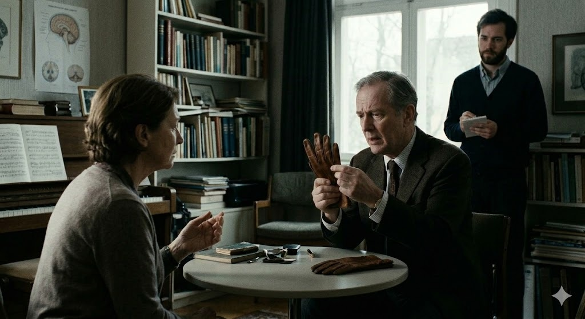

# The Man Who Mistook His Wife for a Hat

The Man Who Mistook His Wife for a Hat (1986), a chamber opera by Michael Nyman (1944 – Present), is based on a real clinical case study by neurologist Oliver Sacks. It portrays Dr. P, a music professor suffering from Visual Agnosia due to damage to the ventral stream, a condition where the brain can perceive individual visual details but cannot synthesize them into a meaningful Gestalt. Dr. P exhibits profound cognitive deficits—mistaking his wife’s head for a hat or failing to recognize a glove as a whole object. [In a poignant scene](https://www.youtube.com/watch?v=8BCsaIlifX0) set in a dimly lit, book-lined consulting room, Dr. P sits at a table across from his wife, turning a brown leather glove over in his hands with a look of deep perplexity, finally describing it as a "curious object... with five pouches," while the neurologist stands quietly in the background taking notes. However, where spatial and visual perception fails, Nyman’s minimalist music steps in as a temporal substitute. As heard in the live opera performances, the relentless, driving pulse of the piano and strings provides a rigid rhythmic framework and linear drive, allowing Dr. P to reconstruct his fragmented reality and navigate daily life. The libretto incorporates Schumann’s "Ich grolle nicht" from Dichterliebe, using its rich tonality to reflect Dr. P's inner struggle to preserve his core identity and dignity, which contrasts sharply with Nyman’s mechanical, diagnostic minimalism. The final scene, where the doctor advises him to "simply continue to sing" because his life is entirely founded on music, powerfully underscores that music is not merely an artistic expression, but an essential neurological life-support system that sustains human existence and identity when language and perception dissolve.

# 아내를 모자로 착각한 남자

마이클 나이먼(Michael Nyman, 1944 ~ )의 실내 오페라 《아내를 모자로 착각한 남자(The Man Who Mistook His Wife for a Hat) (1986)》는 신경과 의사 올리버 색스의 실제 임상 사례를 바탕으로, 시각 실인증을 앓는 음악 교수 P선생의 이야기를 그린다. P선생은 뇌의 복측 경로 손상으로 인해 사물의 세부 요소는 보면서도 전체적인 의미를 통합하지 못하는 인지적 결핍을 보인다. 책이 가득 찬 차분하고 무거운 분위기의 진료실 안에서, P선생이 테이블에 앉아 갈색 가죽 장갑을 손에 쥔 채 깊은 당혹감에 빠져 이를 전체가 아닌 ["다섯 개의 주머니가 달린 기묘한 물건"으로 묘사하는 장면](https://www.youtube.com/watch?v=8BCsaIlifX0)은 파편화된 그의 세계를 시각적으로 극명하게 보여준다. 이때 그의 뒤에서는 신경과 의사가 묵묵히 서서 그의 행동을 기록하며 차가운 임상적 시선을 더한다. 그러나 P선생은 공간적 지각이 가로막힌 자리를 나이먼 특유의 미니멀리즘 음악이 가진 선형적 흐름과 규칙적인 리듬으로 대체한다. 실제 오페라 실황 영상에서 들을 수 있듯, 피아노와 현악기가 만들어내는 끊임없이 몰아치는 기계적이고 규칙적인 맥박은 P선생이 일상의 모든 동작을 노래의 시간적 질서에 맞춰 수행할 수 있도록 돕는 견고한 틀이 되며, 무너진 세계를 음악적으로 재구축한다. 극 중 인용되는 슈만의 《시인의 사랑》 중 "나는 원망하지 않으리"의 따뜻한 조성 음악은 장애 속에서도 보존된 그의 인간적 존엄과 내면을 투영하는 반면, 나이먼의 연속적인 미니멀리즘 선율은 정량적인 진단적 성격을 띠며 절묘한 음향적 대비를 이룬다. 결말에서 의사가 "선생의 삶은 전적으로 음악으로 이루어져 있으니 그냥 계속 노래하십시오"라고 처방하는 장면은, 음악이 단순한 예술을 넘어 언어와 지각이 상실된 한 인간의 정체성과 실존을 지탱하는 필수적인 생명 유지 장치이자 우회로임을 보여준다.

