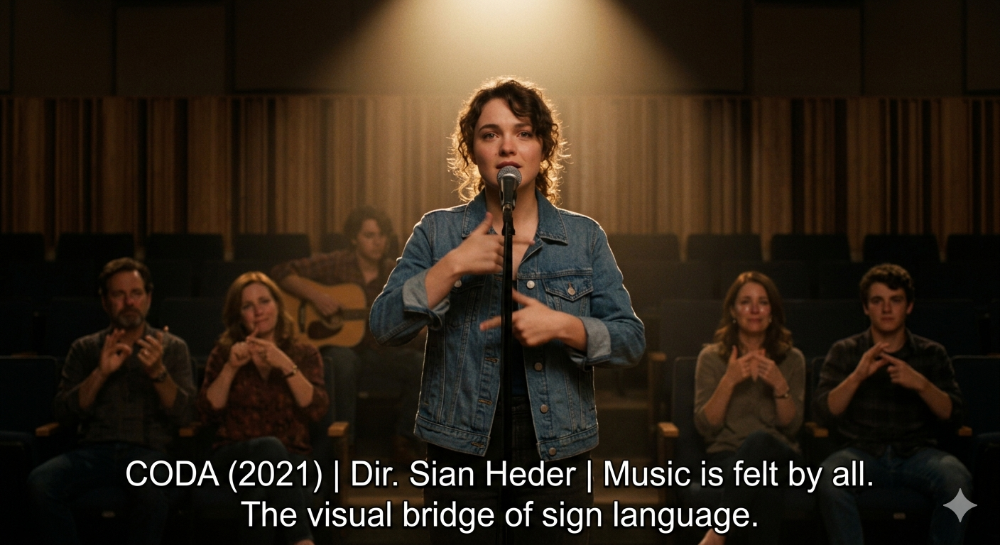

# Coda

The movie *Coda*, directed by Joni Mitchell, explains a life of a girl named "Ruby". The "both sides" mentioned in the lyrics and title of the song "Both Sides Now" refer to the fact that Ruby, the protagonist of the film, is a being who lives experiencing both the "world where sound exists" and the "world of silence where sound does not exist." Ruby is the only person in her family who can hear, and she lives by acting as an interpreter for her family. The song contains many stories leading up to Ruby's acceptance into music school. Initially, this role was closer to a one-way obligation to connect her family with the world; however, as Ruby expands her own world through music, she brings about a profound change in how she communicates with them. Moving beyond the mere mechanical translation of spoken words into sign language, she begins to make a conscious effort to fully share and connect through the world of music and the depth of emotion she experiences. This song, which Ruby sang at her music school audition, demonstrates that music can be extended to the visual language of sign language. Here, the expansion of music into a visual language means more than just conveying the literal meaning of the lyrics to those who cannot hear. It signifies visually embodying and allowing them to feel the pitch of the melody and the fluctuations of emotion through the trajectory of hand gestures, rich facial expressions, and bodily movements. This implies that music can be perceived within one's own physical context, regardless of the presence or absence of hearing. In conclusion, the song "Both Sides Now" in this work emphasizes human dignity by encouraging the recognition of disability not merely as a disease, but as another way of life. In particular, [the moment when music expands into the visual language of sign language on the audition stage](https://youtu.be/SgKvP0O0nyI?si=28nQGoDdULG3br-B) transcends physical contexts, delivering the work's message of human dignity and connection to the reader in a highly multidimensional way.

# 코다

조니 미첼이 제작한 "코다"라는 영화는 "루비"라는 여성의 삶을 설명하고 있다. "이제는 양쪽에서"의 가사와 제목에서 언급하는 ‘양쪽’은 영화 속의 주인공인 루비가 ‘소리가 존재하는 세상’과 ‘소리가 존재하지 않는 침묵의 세상’을 모두 경험하며 살아가는 존재임을 말한다. 루비는 가족 중 유일하게 소리를 들을 수 있는 사람으로, 가족들의 통역사 역할을 하며 살아간다. 초기의 루비에게 이 역할은 가족을 세상과 연결하는 일방적인 의무에 가까웠으나, 음악을 통해 자신의 세상을 넓혀가며 가족과의 소통 방식에도 깊은 변화를 이끌어낸다. 단순히 음성을 수어로 기계적으로 전달하던 차원을 넘어, 자신이 느끼는 음악의 세계와 감정의 깊이를 가족들에게 온전히 공유하고자 노력하게 된 것이다. 루비가 음대에 합격하는 과정까지의 많은 이야기들이 담겨있다. 루비가 음대 오디션에서 불렀던 이 곡은, 음악이 수어라는 시각적 언어로도 확장될 수 있음을 보여준다. 이것은 청각의 유무에 관계없이 각각의 신체적 맥락에서 음악을 지각할 수 있음을 암시한다. 결론적으로 이 작품에서 이 "이제는 양쪽에서" 라는 곡은 장애를 질병으로만 바라보지 않고 또 다른 삶의 한 방식으로 인식하게 함으로써 인간의 존엄성을 강조하고 있다. 여기서 음악이 시각적 언어로 확장된다는 것은 소리를 들을 수 없는 이들에게 단순히 '가사'를 전달하는 것을 넘어, 손짓의 궤적, 표정, 몸의 진동을 통해 선율의 고저와 감정의 파동을 시각적으로 '시각화'하여 느끼게 함을 의미한다. 특히 [오디션 무대에서 음악이 수어라는 시각적 언어로 확장되어 표현되는 순간](https://youtu.be/SgKvP0O0nyI?si=28nQGoDdULG3br-B)은, 청각의 유무라는 신체적 맥락을 초월해 인간의 존엄성과 소통의 가치를 독자에게 가장 입체적으로 전달하는 대목이다.

