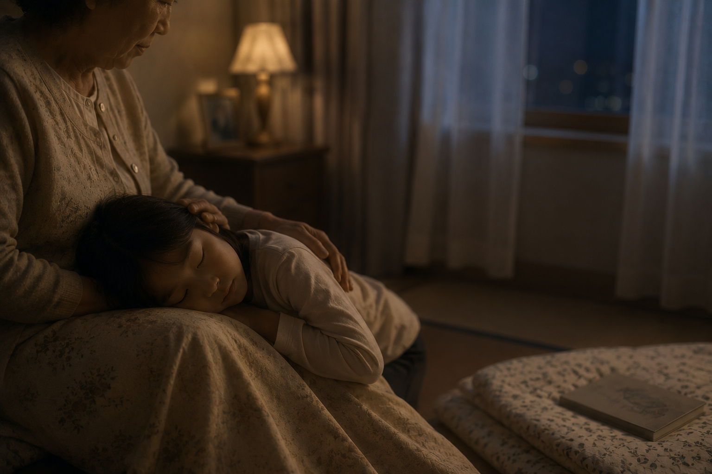

# Knees

IU's [*Knees*](https://youtu.be/SfeaTW4bcAw?si=HWEv0yD7kAuEwNrN) is a song written from the perspective of an adult suffering from insomnia, longing for the peaceful childhood days of falling into a deep sleep while resting on their grandmother's lap. Driven by a gentle guitar melody, the song approaches insomnia not merely as the clinical distress of being unable to sleep, but rather as a "fundamental nostalgia felt by a child who has been forced to grow up." It creates a stark contrast between a busy, exhausted present—where one tosses and turns at the slightest rustle, ever-vigilant—and a past where one slipped into a deep, dreamless sleep enveloped in comforting warmth. 

Sitting blankly all alone in the night when everyone falls asleep / Staying awake, unable to let go of the day that has already passed / Am I waiting for someone, or is there still work left to do? / Or perhaps, am I reminiscing about a nostalgic place I yearn to return to? / When I lie down, resting my head on your knees, stroke my hair just like you did when I was very young / Even if I drift off to sleep at that gentle touch, please leave me be for just a moment / Don't wake me, for I will be sleeping a very deep sleep / Softly, gently, I will be sleeping a deep sleep / Softly, gently, a deep sleep...

The musical characteristics flowing throughout the song render this sense of insomnia and comfort even more multidimensional. The minimalist acoustic guitar melody with stripped-down instrumentation and the slow tempo paradoxically translate the raw stillness of a sleepless night into sound. In particular, the calm, quietly murmuring vocal tone—where even the sound of breathing is vividly captured—brilliantly portrays the current, hyper-sensitive psychological state of tossing and turning, nerves on edge at the slightest stir. Ultimately, "Knees" embraces the loneliness and vulnerability we carry as adults. Through the poignant metaphor of a "lap," it offers warm consolation to our desperate yearning to find comfort and rest once again amidst the harsh realities of daily life. It may also be helpful to refer to [content on depression](choi-dahyeon.md) in relation to this.

# 무릎

아이유의 [무릎](https://youtu.be/SfeaTW4bcAw?si=HWEv0yD7kAuEwNrN)은 불면증을 겪는 어른이 어린 시절 할머니의 무릎을 베고 깊이 잠들었던 평온한 때를 그리워하며 쓴 곡이다. 잔잔한 기타 선율이 돋보이는 이 노래는 불면증을 단순히 잠들지 못하는 병리적 괴로움으로 묘사하는 대신, '어른이 되어버린 아이가 겪는 근원적인 향수'의 관점에서 풀어낸다. 조그만 기척에도 잠을 설치며 더 많은 것을 경계하게 된 바쁘고 지친 현재와, 따뜻한 온기 속에서 꿈조차 꾸지 않고 깊은 잠에 빠졌던 과거를 대비시키고 있는 것이다. 

모두 잠드는 밤에 혼자 우두커니 앉아 / 다 지나버린 오늘을 보내지 못하고서 깨어 있어 / 누굴 기다리나 아직 할 일이 남아 있었던가 / 그것도 아니면 돌아가고 싶은 그리운 자리를 떠올리나 / 무릎을 베고 누우면 나 아주 어릴 적 그랬던 것처럼 / 머리칼을 넘겨줘요 / 그 좋은 손길에 까무룩 잠이 들어도 잠시만 그대로 두어요 / 깨우지 말아요 아주 깊은 잠을 잘 테니 / 스르르르륵 스르르 깊은 잠을 잘 테니 / 스르르르륵 스르르 깊은 잠을...

곡의 전반에 흐르는 음악적 특징들은 이러한 불면과 위로의 감각을 한층 입체적으로 만들어낸다. 악기 구성을 최소화한 미니멀한 어쿠스틱 기타 선율과 느린 템포는 역설적이게도 잠들지 못하는 밤의 적막함을 날것 그대로 청각화한다. 특히 숨소리마저 생생하게 들릴 듯 덤덤하고 조용히 읊조리는 보컬의 톤은, 아주 조그만 기척에도 신경이 곤두서 잠을 설치는 현재의 예민한 심리 상태를 탁월하게 담아낸다. 결국 <무릎>은 어른이 된 우리가 안고 있는 고독과 나약함을 어루만지며, 팍팍한 일상 속에서 다시금 위로와 안식을 얻고 싶어 하는 간절한 마음을 '무릎'이라는 은유를 통해 따뜻하게 위로하고 있다. 이와 관련해서 [우울증에 관한 내용](choi-dahyeon.md)도 참고하면 도움이 될 것 같다.
