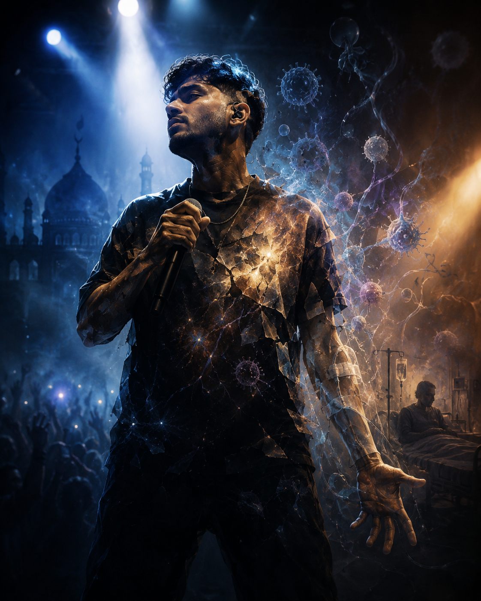

# Mogul Mowgli

The central musical piece in *Mogul Mowgli* (2020) is “Mogambo,” written by Riz Ahmed and Thomas Calvert and performed by Riz Ahmed himself. Its lyrics express anger, resistance, and the will to survive against racism, Islamophobia, surveillance, and social exclusion. In the film, Zed is a British-Pakistani rapper preparing for a world tour, but his sudden autoimmune disease weakens his body and threatens his identity as a performer.

Musically, “Mogambo” is marked by a forceful rap delivery, a fast and assertive flow, and a repetitive beat that pushes the track forward. These sonic features make Zed’s resistance feel not only verbal but also bodily: the voice, rhythm, and breath of rap become the means through which he insists on his presence. Therefore, “Mogambo” is not just an inserted rap song; it represents Zed’s powerful self-image and resistant energy before illness disrupts his life. As the disease progresses, that energetic musical identity is placed in contrast with his vulnerable body, making the conflict between artistic expression and physical limitation more visible.

# 모굴 모글리

<모굴 모글리>(2020)에서 중심이 되는 음악은 “Mogambo”이다. 이 곡은 리즈 아메드와 토머스 캘버트가 작곡·작사했고, 영화의 주연인 리즈 아메드가 직접 연주했다. 가사는 인종차별, 이슬람 혐오, 감시, 배제 속에서도 사라지지 않겠다는 분노와 생존 의지를 랩으로 표현한다. 영화에서 제드는 월드 투어를 앞둔 영국계 파키스탄인 래퍼지만, 갑작스러운 자가면역질환으로 몸이 약해지며 무대와 음악가로서의 정체성을 위협받는다.

“Mogambo”의 저항성은 가사의 의미에서만 나오는 것이 아니다. 빠르게 밀어붙이는 랩 플로우, 강한 발성, 반복적인 비트는 제드가 자신의 존재를 사라지지 않게 만들려는 태도를 청각적으로 드러낸다. 특히 랩에서 목소리와 호흡은 단순한 소리 이상의 의미를 가진다. 제드에게 랩은 자신이 누구인지 말하는 방식이자, 사회적 차별 속에서도 자신의 몸과 정체성을 무대 위에 드러내는 수단이다.

따라서 “Mogambo”는 단순한 삽입곡이 아니라, 병이 찾아오기 전 제드가 붙잡고 있던 강한 자아상과 저항의 에너지를 보여주는 음악이다. 그러나 질병이 진행되면서 이 강한 음악적 정체성은 점점 취약해지는 몸과 대비된다. 영화는 이 대비를 통해 예술가의 목소리가 신체와 분리되어 존재할 수 없다는 점을 보여준다. 결국 <모굴 모글리>에서 음악은 제드의 성공을 장식하는 배경이 아니라, 예술적 표현과 신체적 한계가 충돌하는 순간을 드러내는 핵심 장치로 기능한다.

## 영상 링크

- Riz Ahmed - “Mogambo”: https://www.youtube.com/watch?v=F-lAPR5EWAs&list=RDF-lAPR5EWAs&start_radio=1

## AI 생성 이미지

이 AI 생성 이미지는 무대 위에서 마이크를 든 래퍼의 모습과 병원, 면역세포, 신체의 균열을 암시하는 이미지를 함께 배치한다. 이는 “Mogambo”가 보여주는 강한 예술적 정체성과 자가면역질환으로 인해 흔들리는 몸 사이의 긴장을 시각적으로 표현한 것이다.

## 관련 항목

- [서태원 님의 〈잠수종과 나비〉 항목](https://github.com/hskye79/medicalhumanitiesmusic-2026-1/blob/main/seo-taewon.md): 이 항목은 질병을 겪는 인물의 주관적 경험이 음악과 음향을 통해 전달된다는 점에서 본 글과 함께 참고할 수 있다.
