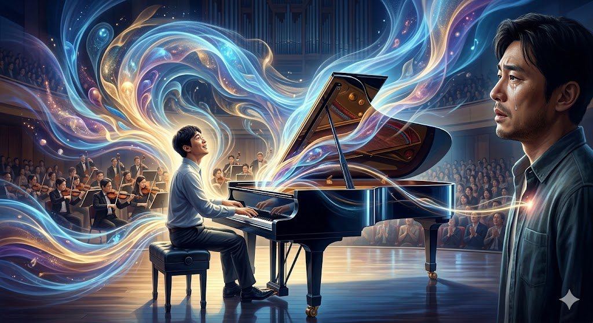

# Keys to the Heart

*Keys to the Heart* is a film released in 2018, in which the protagonist, Jin-tae, is portrayed as having autism spectrum disorder. [The central piece of music featured in this work](https://www.youtube.com/watch?v=fLt6uvYrxRk) is Tchaikovsky's Piano Concerto No. 1 in B-flat minor, and the description of this piece is as follows.

Composer : Pyotr Ilyich Tchaikovsky 

Birth and Death Years : May 7, 1840 – November 6, 1893 

Background and Narrative of the Piece : Composed in 1874, Tchaikovsky initially intended to dedicate this concerto to Nikolai Rubinstein, a leading musician of the time. However, it faced harsh criticism from Rubinstein, who dismissed it as "worthless and unplayable." Refusing to yield, Tchaikovsky left the score unaltered and instead dedicated it to Hans von Bülow. The piece subsequently achieved a historic, monumental success at its Boston premiere in 1875. The narrative of this concerto—overcoming prejudice and harsh criticism to become one of the greatest piano concertos in the history of classical music—deeply resonates with the life of the protagonist, Jin-tae, who shatters societal prejudices against disabilities and proves his existence on stage.

The reflections on how this music portrays the illness or disability within the work are as follows.

In *Keys to the Heart*, highly demanding classical music functions as the most complete and autonomous "language" through which the protagonist, Jin-tae, who has autism spectrum disorder, communicates with the world. Although his everyday language skills and social interaction capacities are significantly lacking, Jin-tae’s performance of Tchaikovsky’s piano concerto—a piece requiring immense technical virtuosity and grand emotional depth—in perfect communion with the orchestra powerfully argues that a disability does not imply the poverty or isolation of one's inner world. His portrayal demonstrates that savant syndrome is a manifestation of pure artistic intuition that transcends cognitive limitations. In other words, his genius—intuitively absorbing auditory stimuli despite being unable to read sheet music and recreating them into flawless melodies—shows that the closed world of autism can ironically serve as a conduit to connect with the essence of music in its purest form, free from external prejudice or calculation. Ultimately, through the medium of music, this work transmutes the medical symptoms of savant syndrome into a wondrous artistic achievement; rather than depicting illness and disability as objects of pity or elements to overcome, it elevates them into a representation of an individual's unique inner depth and the most beautiful means of establishing solidarity with others. In particular, the notion that this piece represents 'the most beautiful way to establish solidarity with others' is dramatically proven during the gala concert performance scene in the latter half of the film. Unlike a solo performance, a piano concerto is a genre that intrinsically demands precise synchronization and communion with dozens of orchestra members and the conductor. Jin-tae, who is usually confined to his own world and struggles even to make eye contact or engage in everyday conversation, listens closely to the orchestra's grand accompaniment and aligns his tempo with the conductor's fingertips, creating perfect harmony with others—at least while on stage. This is a wondrous moment illustrating how the closed world of autism, upon encountering the universal language of music, can autonomously connect and resonate with countless others. In this regard, it would be helpful to refer to [a text that describes how music portrays disability within the same film](lee-chanhyeok.md) as well as [a text illustrating how music functions as a 'second spoken language' through which Jin-tae, who struggles with verbal communication, can converse with others](kim-jeongwoo.md).

# 그것만이 내 세상

《그것만이 내 세상》은  2018년에 개봉한 영화로, 주인공 '진태'는 자폐 스펙트럼 장애를 가진 것으로 묘사된다. [이 작품에서 핵심적으로 사용된 음악](https://www.youtube.com/watch?v=fLt6uvYrxRk)은 차이콥스키의 피아노 협주곡 1번 내림나단조이며, 이 곡에 대한 설명은 다음과 같다. 

작곡가 : 표트르 일리치 차이콥스키 

출생 및 사망 연도 : 1840년 5월 7일 출생 ~ 1893년 11월 6일 사망

곡의 배경 및 줄거리: 1874년 작곡된 이 곡은 작곡 직후 당대 최고의 음악가였던 니콜라이 루빈스타인에게 헌정하려 했으나 "연주가 불가능할 정도로 조잡하다"는 혹평을 받았다. 하지만 차이콥스키는 이에 굴복하지 않고 악보를 수정 없이 한스 폰 뷜로에게 헌정하였고, 1875년 보스턴 초연에서 역사적인 대성공을 거두게 된다. 타인의 편견과 혹평을 이겨내고 클래식 역사상 가장 위대한 피아노 협주곡 중 하나로 자리매김한 이 곡의 서사는, 장애에 대한 세상의 편견을 깨고 무대 위에서 자신의 존재를 증명해 내는 극 중 진태의 삶과 깊이 맞닿아 있다.

이 음악이 작품 속 질병 또는 장애를 묘사하는 방식에 관한 단상은 다음과 같다.

《그것만이 내 세상》에서 고난도의 클래식 음악은 자폐 스펙트럼 장애를 가진 주인공 진태가 세상과 소통하는 가장 완전하고 주체적인 '언어'로 기능한다. 일상적인 언어 구사력이나 사회적 상호작용 능력은 현저히 부족하지만, 고도의 기교와 웅장한 감정선이 요구되는 차이콥스키의 피아노 협주곡을 오케스트라와 완벽하게 교감하며 연주해 내는 진태의 모습은, 장애가 곧 내면세계의 빈곤이나 단절을 의미하지 않음을 강렬하게 역설한다. 이러한 진태의 모습은 서번트 증후군 인지적 제약을 넘어선 순수한 예술적 직관의 발현임을 증명한다. 다시 말해, 악보를 읽지 못함에도 청각적 자극을 직관적으로 흡수하여 완벽한 선율로 재창조해 내는 그의 천재성은, 자폐라는 닫힌 세계가 오히려 외부의 편견이나 계산 없이 음악의 본질과 가장 순수하게 맞닿을 수 있는 통로가 될 수 있음을 보여준다. 즉, 이 작품은 음악이라는 매개체를 통해 서번트 증후군이라는 의학적 징후를 경이로운 예술적 성취로 치환하며, 질병과 장애를 동정이나 극복의 대상으로 표현하는 대신 한 인간이 지닌 고유한 심연과 타인과 연대하는 가장 아름다운 방식으로 격상시켜 묘사하고 있다. 특히 이 곡이 '타인과 연대하는 가장 아름다운 방식'이라는 점은 영화 후반부의 갈라 콘서트 연주 장면에서 극적으로 증명된다. 피아노 협주곡은 독주와 달리 수십 명의 오케스트라 단원들, 그리고 지휘자와의 치밀한 호흡과 교감이 필수적인 장르다. 평소 타인과 눈을 맞추거나 일상적인 대화를 나누는 것조차 버거워하며 자신만의 세계에 갇혀 있던 진태는, 무대 위에서만큼은 오케스트라의 웅장한 반주에 귀를 기울이고 지휘자의 손끝에 자신의 템포를 맞추며 타인과 완벽한 하모니를 만들어낸다. 이는 자폐라는 닫힌 세계가 음악이라는 보편적 언어를 만났을 때, 어떻게 수많은 타인과 주체적으로 호흡할 수 있는지를 보여주는 경이로운 순간이다. 이와 관련해 [같은 영화에 대해서 음악이 작품속 장애를 묘사하는 방식을 적은 글](lee-chanhyeok.md)과 [언어적 소통이 서툰 진태에게 음악이라는 ‘제2의 음성 언어‘를 통해 타인과 대화할 수 있음을 작성한 글](kim-jeongwoo.md)을 참조하면 도움이 될 것 같다.
