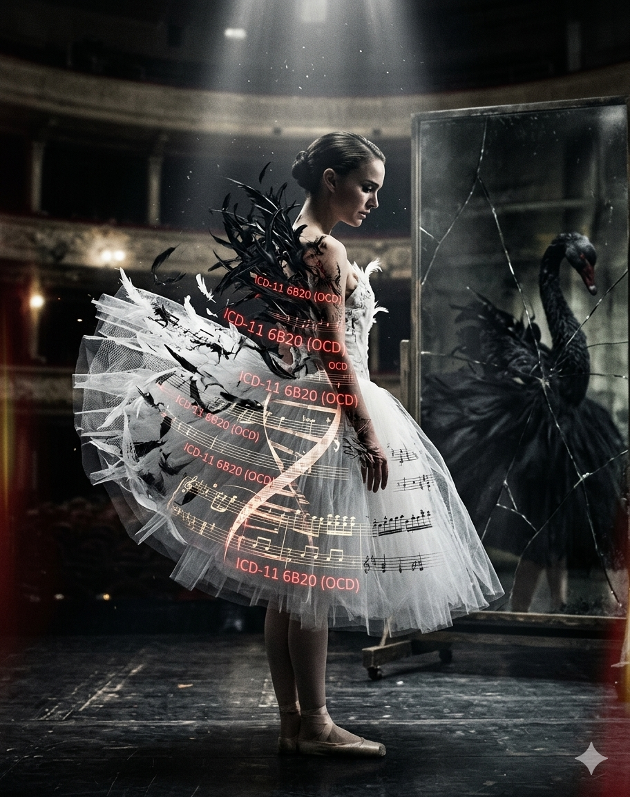

# Black Swan

In Darren Aronofsky's film *Black Swan*, music functions not merely as a background element but as a crucial narrative device that vividly exposes the protagonist's disintegrating psyche. [Tchaikovsky's *Swan Lake* original orchestral score](https://www.youtube.com/watch?v=9rJoB7y6Ncs) serves as a sonic manifestation of Nina's fragmented self, mirroring the structural duality of the pure White Swan and the voluptuous Black Swan. Crucially, this musical score undergoes deliberate stylistic transformations that align with Nina's psychological deterioration. In the earlier acts, the orchestral arrangements are tightly structured, controlled, and melodic, reflecting Nina’s desperate obsession with rigid discipline and behavioral control. However, as she progressively succumbs to the seductive, chaotic allure of the Black Swan, much like the dynamic progression found in [Black Swan OST 'Nina's Dream'](https://www.youtube.com/watch?v=N_A_C8E998w), the musical texture devolves into jarring dissonance, frantic staccato strings, and abrupt accelerandos. This sonic shift allows the audience to aurally experience her uncontrollable psychological spiral and escalating panic.

Through this artistic descent, Nina exhibits concrete, clinical manifestations of Obsessive-Compulsive Disorder (OCD) and severe psychological distress. Her pathological drive for perfectionism is illustrated through meticulous, repetitive rituals, such as compulsively breaking in her ballet slippers and endlessly repeating dance steps to achieve an elusive sense of "completeness." Furthermore, her underlying anxiety manifests physically through dermatillomania—a severe skin-picking compulsion where she scratches her back and fingers until they bleed. The film externalizes her psychological rupture through explicit hallucinatory sequences, such as witnessing her own reflection move independently or perceiving black feathers erupting from her flesh, demonstrating that her obsessive defense mechanisms have collapsed into a full-blown psychotic break.

Ultimately, the standard of the "perfect ballerina" represents a socially constructed norm that demands absolute subjugation. In her internalized pursuit of this impossible ideal, Nina suppresses her true id, leading to a catastrophic fracture of her ego. By dynamically manipulating the musical score and integrating visceral genre elements, *Black Swan* successfully delivers a compelling, sensory-driven commentary on the profound cost of artistic obsession and the tragic formation of severe psychological suffering.

---

# 블랙스완

대런 아로노프스키가 감독한 영화 『블랙 스완』에서 음악은 단순한 배경이 아니라 주인공의 내면을 드러내는 서사적 장치로 기능한다. [차이콥스키의 「백조의 호수」 오리지널 전곡 선율](https://www.youtube.com/watch?v=9rJoB7y6Ncs)은 순수한 백조와 관능적인 흑조라는 이중 구조를 통해 니나의 분열된 자아를 상징한다. 특히 작중에서 이 음악은 니나의 심리 변화에 맞춰 변주되는데, 초반부의 절제되고 명징한 오케스트라 선율은 완벽한 통제를 바라는 니나의 강박을 대변한다. 그러나 니나가 흑조의 매혹에 빠져들수록 영화의 메인 편곡인 [블랙 스완 OST 'Nina's Dream'](https://www.youtube.com/watch?v=N_A_C8E998w) 변주처럼 음악은 불협화음과 날카로운 현악기의 스타카토 주법, 그리고 급격한 템포의 가속으로 연주되며, 이를 통해 관객은 그녀의 통제 불가능한 심리 상태를 청각적으로 체험하게 된다.

이 과정에서 니나는 완벽을 향한 집착과 반복적 행동, 통제 욕구 등 강박장애(OCD)의 구체적인 임상적 양상을 드러낸다. 그녀는 완벽한 동작을 위해 발레 슈즈를 강박적으로 길들이고 똑같은 스텝을 무한히 반복하며, 불안을 해소하기 위해 자신의 등과 손톱 주변의 피부를 피가 날 때까지 뜯어내는 피투성이 자해(Dermatillomania) 증상까지 보인다. 영화 속에서 거울 속의 또 다른 자아가 자신을 쳐다보거나 피부에서 검은 깃털이 돋아나는 구체적인 환각 장면들은 이러한 강박증이 심각한 정신증적 분열로 치닫고 있음을 시각적으로 증명한다.

특히 ‘완벽한 발레리나’라는 기준은 사회적으로 구성된 규범이며, 이를 내면화하는 과정에서 개인은 스스로를 억압하게 되고, 그 긴장이 자아의 균열로 이어진다. 이러한 점에서 이 작품은 음악의 변주와 장르적 연출을 통해 개인의 심리적 고통과 그 형성 과정을 감각적이면서도 설득력 있게 드러낸다.
