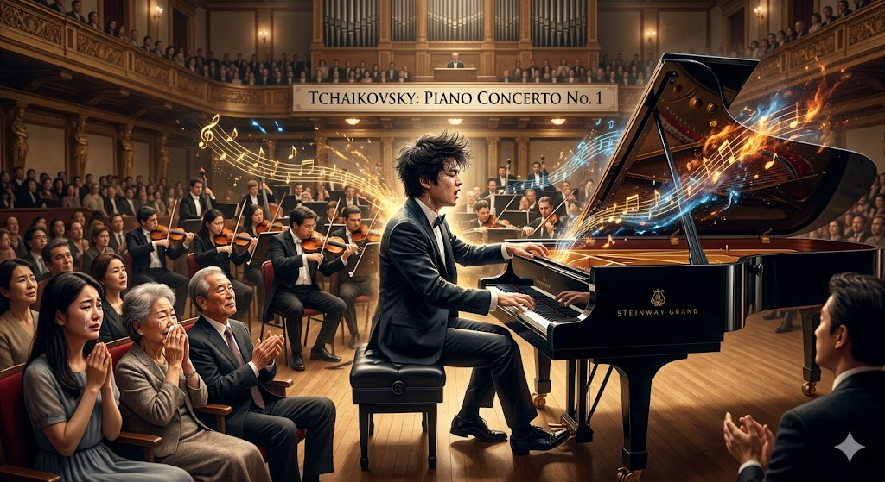

# Keys to the Heart

Tchaikovsky’s 'Piano Concerto No. 1' shatters prejudices against disability by portraying it not as a disconnection in verbal communication, but as an explosive outpouring of emotion through art. In the film, Jin-tae faces various difficulties in his daily life, struggling even with basic verbal communication and social interactions. The scene where Jin-tae performs the majestic melodies of this concerto alongside an orchestra—driven by powerful keystrokes and an immersive, breathtaking atmosphere—stands in stark contrast to his usual presentation as someone who struggles with basic everyday conversation due to his disability. This particular performance is widely regarded as [one of the most memorable and striking scenes in the movie](https://www.youtube.com/watch?v=fLt6uvYrxRk). In particular, the explosive musical characteristics of the piece—such as the fierce, sweeping chords of the passionate introduction and the grand melodies interweaving with the orchestra—vividly channel Jin-tae’s long-suppressed emotions. This serves as both a visual and auditory testament to the fact that his inner world is far more vast and sophisticated than those of the non-disabled. This overwhelming performance deeply moves his family and those around him who once viewed him merely as someone in need of care, transforming their dynamics into a relationship of solidarity and respect. Ultimately, this music suggests that viewing disability solely as a state of "deficiency" is a flawed perspective. At the same time, it emphasizes that individuals with disabilities are proactive agents who communicate with the world on equal footing through artistic achievement, delivering profound inspiration to the public. In this regard, referencing [another essay on the same firm](kim-hyeonseong.md) may provide further helpful insights.

# 그것만이 내 세상

차이콥스키의 '피아노 협주곡 1번'은 장애를 언어적 소통의 단절이 아닌 예술을 통한 폭발적인 감정의 분출로 묘사하여 장애에 대한 편견을 무너뜨린다. 영화 속에서 진태는 평소 일상적인 대화조차 어려워하고 타인과의 사회적 상호작용에서 여러 어려움을 겪는다. 진태가 오케스트라와 함께 강렬한 타건과 몰입감 넘치는 웅장한 선율로 '피아노 협주곡 1번'을 연주하는 장면은 평소 일상적인 대화조차 어려워하던 장애인의 모습과 대비된다. 이 장면은 [영화에서 가장 인상적인 장면 중 하나](https://www.youtube.com/watch?v=fLt6uvYrxRk)이다. 특히, 건반을 몰아치는 격정적인 도입부 화음과 오케스트라와 주고받는 웅장한 선율 등의 폭발적인 음악적 특징은 그동안 억눌려있던 진태의 감정을 생생하게 대변하며, 그의 내면에 비장애인보다 훨씬 거대하고 정교한 세계가 존재함을 시각적,청각적으로 증명한다.이 압도적인 연주는 늘 그를 돌봄의 대상으로만 보던 가족과 주변 인물들에게 깊은 울림을 주며, 그들과의 관계를 연대와 존중의 관계로 변화시키는 계기가 된다. 결국 이 음악은 장애를 결핍의 상태로만 보는 시선이 잘못된 것임을 시사하는 동시에 장애인이 예술적 성취를 통해 세상과 대등하게 소통하며 대중에게 감동을 선사하는 능동적인 주체임을 강조한다. 이와 관련해서는 [같은 영화에 대한 다른 글](kim-hyeonseong.md)도 참조하면 도움이 될 것이다.
