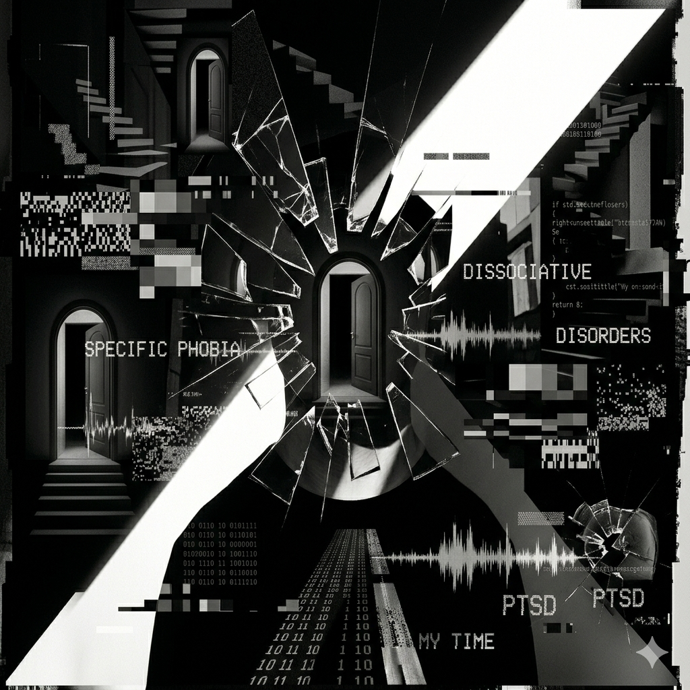

# OMORI

Song Name: My Time , Duet

composer:  Pedro Silva, Jami Lynne, bo en

The plot of the game: Sunny, the main character, cannot overcome the guilt caused by past tragic events, so she becomes Omori, the ego of the dream world, and escapes while isolating herself. It deals with the psychology of a boy wandering between real pain and fantasy in a dream.

The game's ending song "[My Time](https://youtu.be/mzgYj_qCHLg?si=vg2qy8cZJEr8NfdV)"' actively utilizes chip-tune and glitchy elements to reflect reality denial and distorted psychology. The dreamy yet unstable melody and beat maximize the precarious mental state of the protagonist trying to escape from trauma. The fluctuating chip-tune rhythm, which represents the hyper-sensitivity state of certain phobias in the work, and the glitch sound, which breaks off as if past memories penetrate, audibly reproduces the dissociation state in which the sense of reality is collapsed. If the descending scale coincides with [Hospital Rooftop Projection](https://youtu.be/FdmELnpjTpw?si=A2MAz4V0utpTcYeb) ) sharply describes the fragmented cognitive distortion, the opposite song is "[Duet](https://youtu.be/ACon4txJiDA?si=tyH0diVSwxET31m-) ," which comes out when aiming for the true ending of the game. The performance, which is created by the protagonist who decides to escape from the fake fantasy and face the cold reality with an analog melody of violin and piano, proves that music leads to true courage and salvation, not the end of a twisted escape, leaves a lingering impression on the player beyond the dour psychological shock that comes after a strange sense of liberation. It would be even more helpful to refer to [other example](yoon-heeji.md) of the role music plays in the game.

# 오모리

곡명: My Time

작곡가:  Pedro Silva, Jami Lynne, bo en

게임의 줄거리: 주인공 ‘써니’가 과거의 비극적인 사건으로 인한 죄책감을 이기지 못해, 자신을 격리한 채 ‘화이트 스페이스’라는 꿈속 세계의 자아 ‘오모리’가 되어 도피하는 과정을 그립니다. 현실의 고통과 꿈속의 환상 사이에서 방황하는 소년의 심리를 다룬다.

이 게임의 엔딩곡 ‘[My Time](https://youtu.be/mzgYj_qCHLg?si=vg2qy8cZJEr8NfdV)’은 현실 부정과 왜곡된 심리를 반영하기 위해 칩튠과 글리치 요소를 적극 활용한다. 몽환적이면서도 불안정한 멜로디와 박자감은 트라우마로부터 도피하려는 주인공의 위태로운 정신 상태를 극대화한다. 작중 등장하는 특정공포증의 과각성 상태를 대변하듯 요동치는 칩튠 리듬과, 과거의 기억이 침투하듯 뚝뚝 끊어지는 글리치 사운드는 현실 감각이 붕괴된 해리 상태를 청각적으로 재현한다. [병원 옥상 투신 연출](https://youtu.be/FdmELnpjTpw?si=A2MAz4V0utpTcYeb)과 맞물리는 하강 음계가 이처럼 파편화된 인지적 왜곡을 날카롭게 묘사한다면, 이와 정반대의 대척점에 서는 곡은 게임의 진엔딩을 목표로 할 때 나오는 '[Duet](https://youtu.be/ACon4txJiDA?si=tyH0diVSwxET31m-)' 이다. 가짜 환상에서 벗어나 차가운 현실을 마주하기로 한 주인공이 바이올린과 피아노의 아날로그 선율로 자아내는 이 연주곡은, 음악이 뒤틀린 도피의 끝이 아닌 진정한 용기와 구원으로 이어짐을 증명하는 이 곡은, 플레이어에게 기묘한 해방감 뒤에 오는 먹먹한 심리적 충격을 넘어 여운을 남긴다. 음악이 게임 내에서 어떤 역할을 하는지 [다른 사례](yoon-heeji.md)들을 함께 참고하면 더욱 도움이 될 것이다.
