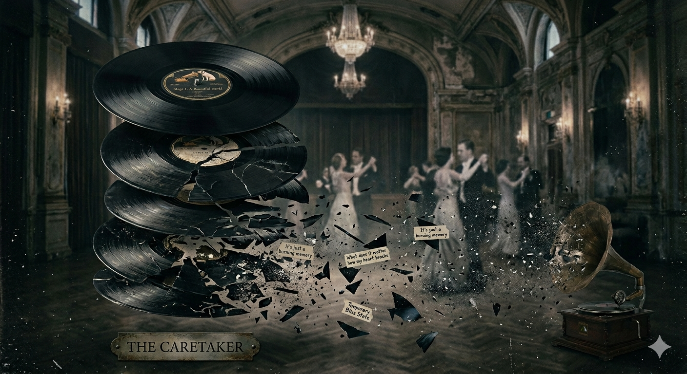

# Everywhere at the end of time

_Everywhere at the end of time(2016-2019)_ is a six-part album cycle released between 2016 and 2019, designed to let listeners experience the progression of dementia through sound.

This [series](https://www.youtube.com/watch?v=wJWksPWDKOc) was created by the English musician James Leyland Kirby (b. 1974-05-09) under the persona The Caretaker. In interviews, Kirby said the project initially began as an idea to give a new release dementia, but he eventually shifted the concept to giving The Caretaker persona dementia itself, turning the project into an exploration of memory, nostalgia, and loss. He also said that his “grandfather” suffered dementia in later life after a series of strokes, and that he tried to approach the subject “with great respect.” The music was built from transformed and rearranged recordings of 1920s–1930s British ballroom music. Kirby described the first stages as “flashbacks of clear thought,” while Stage 4 becomes “the moment of pure confusion,” marking a shift into the post-awareness phase. In that sense, the work is not just about depicting dementia, but about using The Caretaker as a fictional persona to shape a subjective, collapsing experience of memory in sound. [Reference](https://www.electronicbeats.net/the-caretaker-unsound-leyland-james-kirby)

As dementia progresses, the album reflects the deterioration of memory by repeatedly reintroducing the same samples in altered forms, with added noise, removed instruments, and increasingly fragmented textures. The track titles also reflect this trajectory: titles such as “It’s just a burning memory,” “What does it matter how my heart breaks,” and “Temporary Bliss State” suggest the collapse of memory and emotional change.
In this work, music serves as a medium through which the disappearance of memory and the instability of the self can be experienced aurally. Especially in the later stages, even the recurring melodies are transformed to the point of being almost unrecognizable, allowing the listener to vicariously experience the anxiety and confusion of gradually losing one’s sense of time and identity. In this respect, the work can be seen not merely as a medical description of dementia, but as an artistic representation of the confusion and loss subjectively experienced by patients. In this regard, referencing the [content of other movies](kim-nakyeon.md) may also be helpful.

# 시간의 끝 어디에서나 (*Everywhere at the end of time*)

_Everywhere at the end of time(2016-2019)_ 는 2016년부터 2019년까지 6차례에 걸쳐서 공개된 연작 앨범으로, 치매가 진행되는 과정을 음악적으로 체험하게 하는 작품이다.

이 [시리즈](https://www.youtube.com/watch?v=wJWksPWDKOc)는 영국의 음악가 제임스 레이랜드 커비(James Leyland Kirby, 1974-05-09~)가 The Caretaker라는 페르소나를 내세워 제작했다. Kirby는 인터뷰에서 이 프로젝트가 처음에는 새로운 작품에 치매를 부여하려는 발상에서 출발했지만, 결국 The Caretaker라는 페르소나 자체에 치매를 설정하는 방향으로 확장되어, 이후 기억, 향수, 상실을 탐구하는 프로젝트로 발전했다고 말했다. 또한 그는 자신의 할아버지가 여러 차례의 뇌졸중 이후 말년에 치매를 겪었으며, 이 주제를 신중한 태도로 다루고자 했다고 밝혔다. 음악은 1920~30년대 영국 무도회 음악을 변형하고 재구성한 음원을 바탕으로 만들어졌다. Kirby는 초반 단계들을 “또렷한 사고의 회상(flashbacks of clear thought)”에 가까운 상태라고 설명했고, Stage 4는 “순수한 혼란의 순간(the moment of pure confusion)”으로 넘어가며 인식 이후(post-awareness) 단계에 들어간다고 말했다. 그런 의미에서 이 작품은 단순히 치매를 묘사하는 데 그치지 않고, The Caretaker라는 허구적 페르소나를 통해 기억이 무너져 가는 주관적 경험을 소리로 형상화한 작업이라고 할 수 있다. [출처](https://www.electronicbeats.net/the-caretaker-unsound-leyland-james-kirby)

치매가 진행되며 기억이 손상되는 과정을 반영하듯, 몇몇 곡들은 동일한 샘플을 바탕으로 노이즈가 더해지거나 악기와 음이 빠지는 방식으로 변형되어 반복 수록되어 있다. 곡 제목들도 이런 흐름을 반영하는데, "It's just a burning memory", "What does it matter how my heart breaks", "Temporary Bliss State" 같은 제목이 기억의 붕괴와 정서적 변화를 암시한다.
이 작품에서 음악은 치매 환자의 기억이 지워지고 자아가 흔들리는 과정을 청각적으로 체험하게 하는 매개가 된다고 생각한다. 특히 후반부로 갈수록 반복되던 멜로디조차 거의 알아들을 수 없게 변형되면서, 청자는 점차 시간 감각과 정체성을 잃어가는 불안과 혼란을 간접적으로 경험하게 되는 것 같다. 이러한 점에서 이 작품은 치매를 단순히 의학적 증상으로 설명하는 것이 아니라, 환자가 주관적으로 경험하는 혼란과 상실을 예술적으로 표현한 사례라고 볼 수 있다. 이와 관련해서는 [다른 영화의 내용](kim-nakyeon.md)도 참조하면 도움이 될 것이다.
