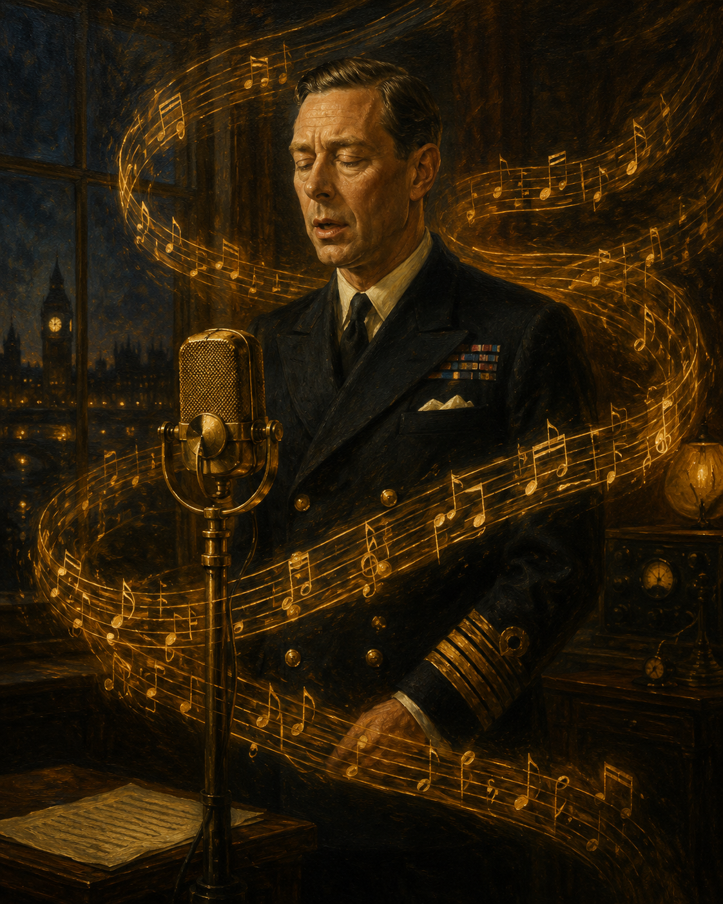

# The King's Speech

In *The King's Speech (2010)*, the film effectively illustrates the situation of the King, who had to deliver a speech during World War II despite his stuttering, by utilizing music. The second movement (Allegretto) of Beethoven's Symphony No. 7, which flows during [the final speech scene](https://www.youtube.com/watch?v=W9UktXoM6Zw), is built on a relentlessly repeated dotted rhythm (long-short-short-long-long) in A minor that creates a slow, steady pulse. This pulse functions as an external scaffold for George VI's fractured speech: where his voice breaks, the orchestra carries the line forward; where he pauses, the harmonic progression sustains the emotional continuity. The camera work and editing in the scene also synchronize with this musical pulse, gradually moving in from wide institutional shots to close-ups of the King's face and trembling lips, while the orchestra's dynamics swell with each phrase he manages to complete.

Importantly, the film does not depict George VI as someone who *overcomes* or *erases* his stutter. He still stumbles, still pauses, still struggles—but he speaks. His voice is moving precisely *because* it remains a stuttering voice, not in spite of it. At the point where Beethoven's music—composed while he was losing his hearing—meets the voice of a King who could not fluently speak, music does not "cure" disability but instead becomes the medium through which a disabled body performs its public role. A similar dynamic between classical music and disability can be found in [Lee Jaejoon's analysis of *Shine* (1996)](https://github.com/hskye79/medicalhumanitiesmusic-2026-1/blob/main/lee-jaejoon.md), which traces pianist David Helfgott's relationship with Rachmaninoff's Piano Concerto No. 3.

# 킹스 스피치

이 영화는 음악을 이용해 제 2차 세계 대전 당시 말더듬증을 갖고 연설을 해야했던 국왕의 상황을 잘 표현해준다. 마지막 [연설 장면](https://www.youtube.com/watch?v=W9UktXoM6Zw)에서 흐르는 베토벤 교향곡 7번 2악장 알레그레토는 a단조의 점음표 리듬(길게-짧게-짧게-길게-길게)이 집요하게 반복되며 느리고 규칙적인 박동을 만들어낸다. 이 박동은 조지 6세의 끊어지는 발화를 외부에서 떠받치는 비계(scaffold)로 기능한다. 그의 목소리가 끊어지는 순간 오케스트라가 선율을 이어가고, 그가 멈추는 순간 화성 진행이 정서적 연속성을 유지시킨다. 또한 이 장면의 카메라 워크와 편집 또한 음악의 박동과 동기화된다. 처음에는 BBC 스튜디오와 마이크를 비추는 넓은 쇼트로 시작했다가 점차 국왕의 얼굴과 떨리는 입술을 클로즈업하며 들어가고, 그가 한 구절씩 완수할 때마다 오케스트라의 음량이 함께 부풀어 오른다.

다만 이 영화는 조지 6세가 말더듬증을 *극복*하거나 *없애는* 모습으로 그를 그리지 않는다는 점을 짚어둘 필요가 있다. 그는 여전히 더듬고, 멈추고, 힘겨워한다. 그럼에도 *말한다*. 국왕의 목소리가 감동적인 것은 그것이 더듬는 목소리이기를 멈췄기 때문이 아니라, 더듬는 목소리인 *채로* 자신의 역할을 수행하기 때문이다. 청력을 잃어가던 작곡가의 음악과 유창하게 말할 수 없던 군주의 목소리가 만나는 지점에서, 음악은 장애를 *치료*하는 것이 아니라 장애를 가진 신체가 공적 역할을 수행하는 *매개*가 된다. 클래식 음악과 장애의 관계를 다룬 유사한 사례는 [이재준 학생의 「샤인(Shine, 1996)」 분석](https://github.com/hskye79/medicalhumanitiesmusic-2026-1/blob/main/lee-jaejoon.md)에서도 확인할 수 있다.
