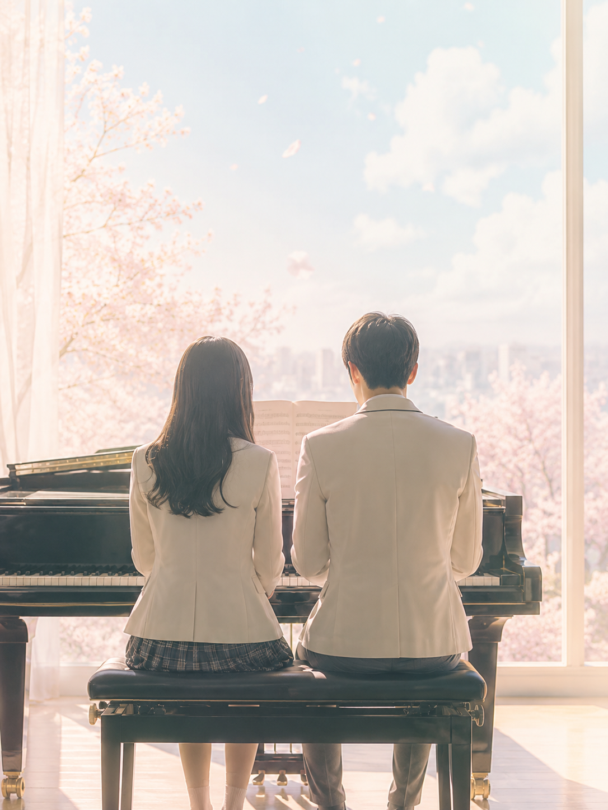

# Page Turner

*Page Turner* is a story of a gifted pianist and a promising athlete who, after an accident, find themselves on the verge of giving up their dreams and lives, but gradually regain hope through their relationships with others. In a situation where they are forced to abandon the dreams they have long pursued, the piano serves as a medium that connects the characters and leads them toward a new way of living. Yu-seul says continuing to play the piano after losing her sight is a "losing battle" and tries to quit playing the piano because she cannot go as high as she wants. Cha-sik, who had to give up his athletic career due to injury, sets the piano as a new goal and persuades Yu-seul, to play the piano. Cha-sik, who has just started playing the piano, challenges himself in a double piano competition to prove his potential amid everyone's disregard. For this competition, the fourth movement of Symphony No. 9 is used. This symphony, composed in 1824 by Ludwig van Beethoven after he had completely lost his hearing, is notable for incorporating vocal and choral elements. With lyrics adapted from a poem by Friedrich Schiller, the piece harmonizes uplifting and hopeful text with a grand yet weighty orchestral sound. The progression of Symphony No. 9—from a tense opening to a bright and majestic climax—mirrors the characters’ journey from despair to the discovery of a new direction in life. In particular, Yu-seul's genuine smile while performing the piece evokes Beethoven, who continued to create music despite his hearing loss. In addition, Cha-sik’s achievement of reaching, at the very last moment, a level of speed he had been unable to attain during the competition preparation period suggests a hopeful future for him as a pianist. In this way, music in the drama is not portrayed as a means of overcoming disability and the confusion and loss it brings, but rather as a catalyst for transforming one’s perception of life and self. In this regard, you can refer to [The Theory of Everything](choi-mihyen.md).

[performance video](https://youtu.be/eaeX_TMYC6w?si=1AaNBxI00VXULyKw)

# 페이지터너

‘페이지 터너’는 KBS의 3부작 드라마로, 천재 피아니스트와 천재 운동선수가 사고로 꿈과 삶을 포기하려는 순간 주변 인물과의 관계를 통해 희망을 되찾는 이야기이다. 오랫동안 좇아온 꿈을 포기할 수밖에 없던 절망적인 상황 속에서 피아노는 인물들을 연결하고, 새로운 인생을 살아가게 만든다. 유슬은 시력을 잃은 후 피아노를 계속 하는 것을 '덤벼봤자 지는 싸움'이라고 말하며 원하는 높은 곳까지 올라갈 수 없기에 피아노를 그만두려 한다. 부상으로 운동을 포기해야 했던 차식은 피아노를 새로운 목표로 잡고 유슬을 설득해 피아노를 베우기 시작한다. 이제 막 피아노를 시작한 차식은 모두의 무시 속에서 자신의 가능성을 증명하기 위해 더블 피아노 콩쿠르에 도전한다. 이때 콩쿠르 곡으로 베토벤 교향곡 9번 중 4악장이 사용된다. 교향곡 9번은 베토벤이 청력을 완전히 잃은 상태에서 1824년에 쓴 마지막 교향곡으로, 노래와 합창을 수반한 것이 특징이다. 프리드리히 드 실러의 시를 가사로 활용하여 희망적이고 환희에 찬 가사와 밝으면서도 무거운 오케스트라의 조화가 아름답다. 긴장감 있는 도입부에서 점차 밝고 웅장한 분위기로 전개되는 교향곡 9번은 좌절을 겪은 인물들이 새로운 인생의 방향을 찾는 모습과 유사하다. 특히 교향곡 9번을 연주하며 진정한 행복의 미소를 짓는 유슬의 모습은 청각 장애에도 음악을 포기하지 않고 이어나간 베토벤을 연상시킨다. 또한 콩쿠르 준비 기간 동안 도달하지 못했던 속도를 마지막 순간에 이루어낸 차식은, 피아니스트로서의 희망적인 미래를 암시한다. 즉, 드라마 속에서 음악은 장애와 그로 인한 혼란과 상실의 감정을 극복의 대상이 아닌, 삶과 자신에 대한 인식을 변화시키는 계기로 나타낸다. 이와 관련하여, [사랑에 대한 모든 것](choi-mihyen.md)를 참조할 수 있다.

[연주 영상](https://youtu.be/eaeX_TMYC6w?si=1AaNBxI00VXULyKw)
