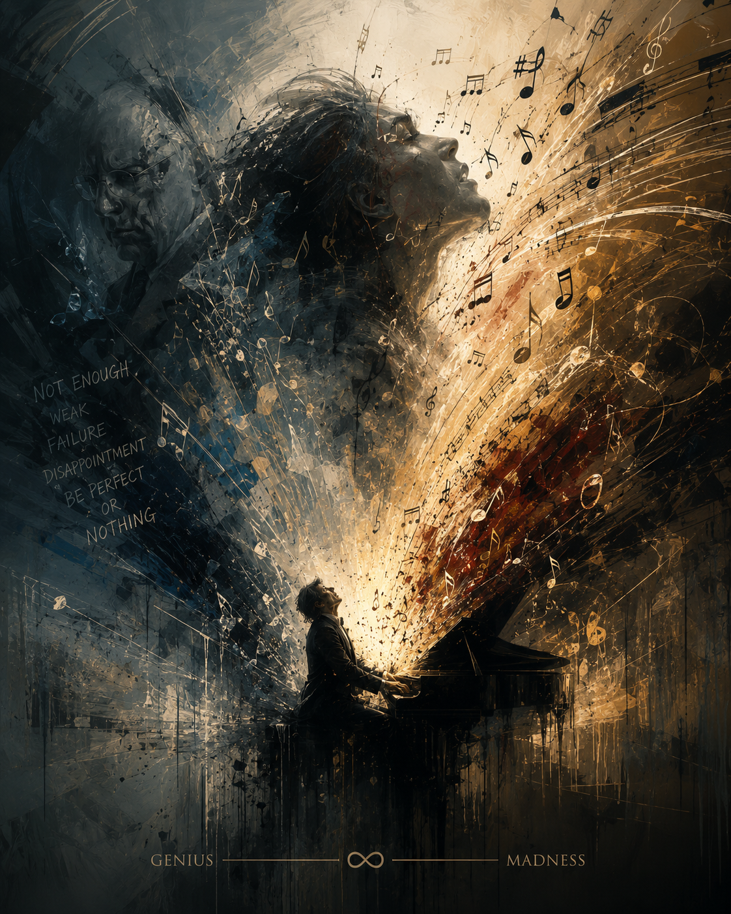

# Shine 

I chose the film *Shine* (1996), directed by Scott Hicks. The mental conditions depicted in this film are schizophrenia and nervous breakdown. The primary piece of music used is Rachmaninoff's Piano Concerto No. 3 in D minor, Op. 30. The composer, Sergei Rachmaninoff, was born on April 1, 1873, in Russia, and died on March 28, 1943, in California, USA. The concerto is considered one of the most technically demanding works in the piano repertoire, pushing performers to their absolute limits through sweeping octave leaps, rapid double notes, continuous arpeggios, and trills. The cadenza of the first movement is particularly notable as an extended solo passage in which the pianist must sustain the entire musical weight without any orchestral support. Let's listen to the [music](https://www.youtube.com/watch?v=N29WamXg4pY) used in the film.

In *Shine*, Rachmaninoff's Piano Concerto No. 3 is not merely background music — it seems to express the protagonist's mental illness through the music itself. The notes that accumulate relentlessly before erupting resemble the psychological structure of David, who is torn between his father's oppression and his own perfectionist compulsions. The director places the climax of the performance and the onset of mental collapse at the exact same moment, effectively fusing the music with the musician. Through this musical arrangement, I felt that just as David's genius was the product of his father's oppression and perfectionist obsession pushed to the extreme, his madness too was what remained after that same flame had burned through everything inside him. Genius and madness were not two separate things, but two directions of the same energy. For further reference, [the content of another film](yeum-gawon.md) may also be helpful in this regard.

# 샤인

스콧 힉스 감독의 영화 <샤인> (Shine, 1996)을 골랐다. 이 영화에 묘사된 질병은 조현병과 정신 붕괴이다. 사용된 주요 음악은 라흐마니노프의 피아노 협주곡 제3번 d단조 Op.30이다. 작곡가는 세르게이 라흐마니노프로 1873년 4월 1일 러시아에서 태어났으며 1943년 3월 28일 미국 캘리포니아에서 사망했다. 이 곡의 특성으로는 기술적으로 가장 난도 높은 곡 중 하나로 꼽힌다. 광대한 옥타브 도약과, 빠른 속도의 중음, 연속적인 아르페지오와 트릴등으로 연주자를 극한으로 몰아붙이는 요소들이다. 특히 1악장 카덴차는 독주자가 오케스트라 없이 홀로 감당해야 하는 긴 독백 구간이다. 영화에 사용된 [음악](https://www.youtube.com/watch?v=N29WamXg4pY)을 감상해보자. 

주인공 데이비드 헬프갓은 권위적인 아버지의 억압과 극도의 연주 압박 속에서 라흐마니노프 피아노 협주곡 3번을 완주한 직후 무대 위에서 정신붕괴를 일으키며 조현병 진단을 받고 수년간 정신병원에 입원하는데, 영화는 이를 외부의 과도한 기대가 내면을 산산조각 낸 결과로 묘사한다. <샤인>에서 라흐마니노프 피아노 협주곡 3번은 단순한 배경음악이 아니라 주인공의 정신 질환 자체를 음악으로 표현한 것 같다. 끊임없이 축적되다가 폭발하는 음들이 아버지의 억압과 완벽주의적 강박 사이에서 분열되는 데이비드의 심리 구조와 닮았다. 감독은 연주의 절정과 정신 붕괴의 시작을 같은 순간에 배치해 음악과 연주자를 합체시킨다. 이러한 음악 배치를 통해, 데이비드의 천재성이 아버지의 억압과 완벽주의적 강박에 의해 극한까지 연소된 결과물이었듯, 그의 광기 역시 그 동일한 불꽃이 내면을 다 태워버린 끝에 남은 것임을 느꼈다. 천재성과 광기는 서로 다른 것이 아니라 같은 에너지가 향하는 두 방향이었다. 이와 관련해서는 [다른 영화의 내용](yeum-gawon.md)도 참조하면 도움이 될 것이다.
