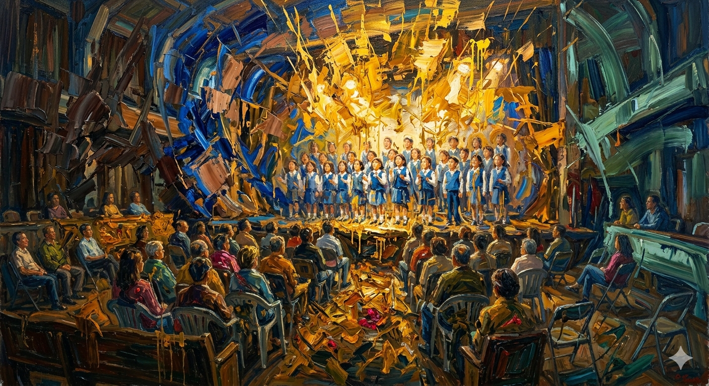

# Miracle in Cell No.7 (2013)

The movie Miracle in Cell No. 7 is about a heartwarming and tear-jerking paternal love between 'Yong-gu,' a father with an intellectual disability who is wrongfully sentenced to death, and the inmates of Cell No. 7 who try to help him. Rather than gloomily depicting the protagonist Yong-gu’s intellectual disability as a deficiency or a source of suffering, the film's music overall portrays him as a pure, child-like being through bright and sweet melodies.

"Angel's Song" places an elementary school choir and the prisoners in the same scene, making the protagonist look like a pure and transparent being on the inside despite being an adult in a prison uniform, thereby inducing deep empathy rather than pity from the audience toward his disability. The purer the music, the more it highlights the gap between the cold reality of prison and the death sentence that Yong-gu faces, ironically maximizing the audience's sorrow. Along with lyrics such as "Within that, we dream" and "The angels smile upon us," the warm and sweet melody of the piano and the pure voices of children focus on the more universal values of paternal and familial love rather than the deficiencies of disability, drawing a broader empathy for humanity from the audience.

In this regard, referring to [Inseparable Bros](yang-jiseok.md) would be helpful.

# 7번방의 선물 (2013)

영화 '7번방의 선물'은 억울한 누명으로 사형 선고를 받은 지적장애인 아빠 '용구'와 그를 돕는 교도소 7번방 수감자들의 눈물겨운 부성애를 다룬 영화이다. 영화의 음악들은 전반적으로 주인공 ‘용구’의 지적장애를 결핍이나 고통으로 암울하게 묘사하기 보단 밝고 감미로운 선율을 통해 순수하고 어린아이 같은 존재로 묘사한다.

'[Angel's Song](https://www.youtube.com/watch?v=pJjOIXbgfCU)'은 초등학교 합창단과 죄수를 한 장면에 배치함으로써 주인공은 죄수복을 입은 성인의 모습이지만 그 내면은 맑고 투명한 존재로 보이게 함으로서 관객들에게 주인공의 장애를 향해 동정보단 깊은 공감을 유도한다. 음악이 순수할수록 주인공 용구가 처한 차가운 감옥과 사형이라는 현실과의 간극이 부각되며 관객의 슬픔을 아이러니하게 극대화하는 장치로 쓰인다. '우리는 그 속에서 꿈 꾸죠'나 '천사들은 미소지어 주네'와 같은 가사와 함께 피아노의 따뜻하고 감미로운 선율과 순수한 아이들의 목소리를 중심으로 장애가 가진 결핍보다 주인공이 가진 부성애와 가족애라는 보다 보편적 가치에 집중하게 함으로 관객들에게 인류에 대한 보다 넓은 공감을 이끌어낸다. 

이와 관련해서는 [나의 특별한 형제](yang-jiseok.md)를 참조하면 도움이 될 것이다.
